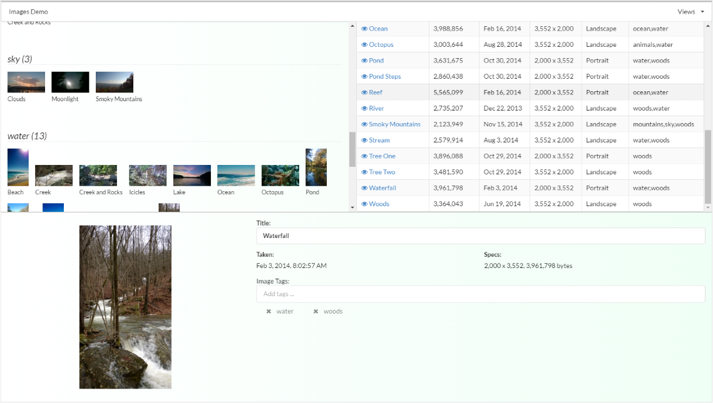
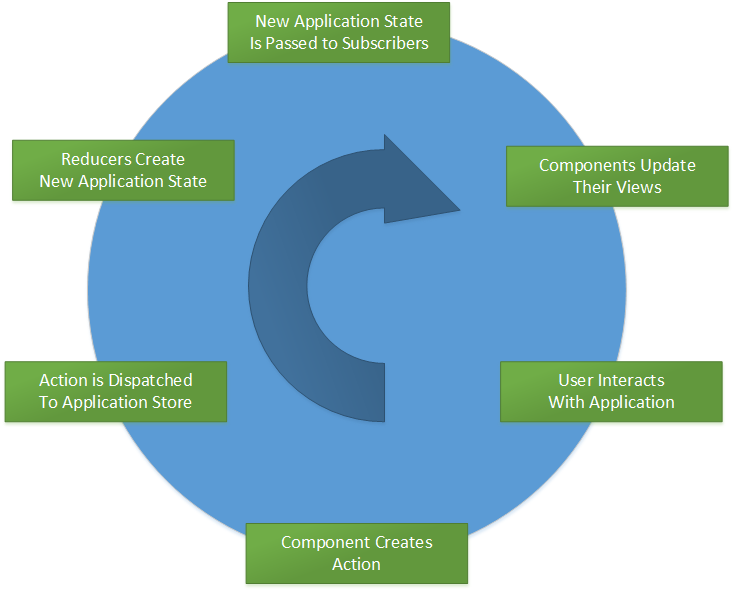
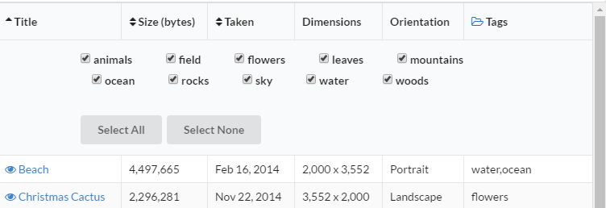

In this post, I want to focus on managing application state. In the
[example application](https://github.com/ng-cookbook/angular2-redux-complex-ui),
I tried to create an application that had a reasonably complex user interface
("complex" is relative here, of course). The user interface needed to
show where changes in one area of the page had immediate impact
on other areas.

If we look at the "edit view" of the application, there are three panels: the
list of images grouped by tags, a details table of image information, and the
image edit panel. User actions performed in one of these panels have an
immediate effect on the other panels.



For example,

- In the details table, a user can sort the image details by the image title,
size of the image, and by the date the image was taken. When the images are sorted
by title, changes to the title in the edit view are reflected in the table itself
and may change the order the images are listed in.

- Changing the order that images are sorted by affects not only the details table, but
also changes the order that images are displayed within each group.  Images in each
group will be sorted in the same order as the detail table.

- Picking a subset of tags to filter the list of images by changes the images
displayed in both the details table and in the grouped images.

- Assigning tags to an image in the edit panel changes the list of tags and
images displayed in the group view.  Tags are added or removed as necessary
based on the set of all tags assigned to all images.  Of course, this changes
the list of tags that can be selected for filtering as well.

These interactions represent changes in application state.

## Managing Application State

If you consider the pieces that make up the application state, you might come
up with a list like:

- The list of images and their details.
- The current order that images are sorted in and whether it is ascending or descending order.
- The set of tags that the user has selected to display.

There are, of course, a number of ways to approach the problem of dealing with
your application's state and how changes are managed.  A popular idea has been
using publish/subscribe messaging to pass around information about changes to state.
For example, a "sorted images" message might be published where subscribers would
respond to this event by performing a sort operation on the displayed images.

Angular1 even formalized this message passing through the use of the
[$scope $emit/$broadcast (publish) and $on (subscribe)](https://docs.angularjs.org/api/ng/type/$rootScope.Scope#$on)
functions.

The problem with this technique is that as the application grows and includes more complex
interactions with the user, it becomes harder to reason about what is actually happening in the
application. How does one message affect the application overall? What happens when one
message causes a cascade of other messages? It becomes harder to predict what an application
will actually do as the user interacts with the application.

So, what if you could organize your application so that changes to application state are more
understandable and predictable?
This is the problem that [Redux](http://redux.js.org/) attempts to address.

## Redux

Redux bills itself as a "predictable container for Javascript apps".  It does this by
specifying a pattern for constraining access to the application state and how
it is changed (mutated).  I don't want to go into all the details of Redux
here because the [documentation](http://redux.js.org/) is excellent. Also,
the ["Cartoon Intro to Redux"](https://code-cartoons.com/a-cartoon-intro-to-redux-3afb775501a6#.1tqyg0ur9)
is also a fun introduction to the basic ideas behind Redux.

Components obtain application state information, in our case things like images, sort order, tags,
etc., from a central "application store", which is managed by the Redux library.  Components do not directly change
the state, but create actions that are dispatched to the application store.  The actual changes are performed by
reducers that are added to the application store when it is first set up. Once the changes are made, the new
application state is passed out to the components that subscribe to the application store change event.  View
components can then modify the user interface accordingly.

There is a cycle, then, that the application goes through to manage transitions from one application state to the
next. A user interacts with the application, a component translates that interaction into an action that is
dispatched to the application store, the store applies reducers to the action to mutate the state, the application
state is passed out to components that have subscribed to the application state change event, and the views update their
UI based on the new state.



At first glance, this extra complexity might not seem worth the trouble.  And it may not
be the right solution for a lot of applications, but the ideas behind Redux have become popular
and offer several benefits.

- View components are simpler since decisions about how the application state should change
based on some user action are delegated to another isolated area of the application (the
reducers).  In other words, view components translate a user activity to an action
and the reducers determine how that action should mutate the application state.  A nice,
clean separation of concerns.

- The application store is the single authority (the "system of record") for the application state.
View components serve a simple purpose to take in the application state and generate the view
that represents that state.

- Since all application state changes go through the application store, many different
user interactions can have the same result on application state. Application state is
maintained consistently regardless of how the state change was initiated and even if it
was initiated by different events.

- Having a central application store then allows your application to hook into the
store itself to provide additional functionality, such as logging application state changes,
undo/redo operations, time-travelling debugging, and more.

Some of this might seem like common sense and could be accomplished in different ways. However, I've worked on many
different applications with distributed teams of various sizes and skill levels, and I like the benefit that it brings
to this situation as well. In applications with a complex user interface and with team members working on related parts
at the same time, it defines good boundaries that help prevent cases where subtle changes to the application state
are hidden within a large project.  It allows teams to reason better about what changes to the application state
really mean.

## Actions

Let's look at some of the actions that the example application uses.  An action corresponds
to something important that happened within the application and holds additional information
about what happened. An action does not perform any function. It only serves to hold
information (that ultimately will be passed on to a reducer).

For example, when the user chooses to sort the images, an action is created that holds
the property that the images should be sorted by and includes whether the images should
be sorted in ascending or descending order.

```javascript
export const SORT_IMAGES = 'SORT_IMAGES'

export enum ImageSortBy {
    title,
    size,
    date
}

export function sortImages(sortBy: ImageSortBy, isAscending: boolean = true) {
    return {
        type: SORT_IMAGES,
        payload: { sortBy, isAscending }
    }
}
```

The `sortImages` function is called an "action creator".  It creates the action itself.  The action has a
type (`SORT_IMAGES`) and additional "payload" information: the property to sort by and the order of the sort.

An action creator function is not required, but I find that action creators are handy in ensuring consistency of
the action data itself. Also, in a future post I'll talk about using action creators as a "thunk" into the Redux
dispatch mechanism that allows us to do asynchronous operations (like loading the initial list of images).

I'm also using a format for actions that follows the [Flux Standard Action](https://github.com/acdlite/flux-standard-action)
syntax. Actions are just objects and can be any format you want, but conforming actions
to a standard like this helps to make actions more understanble and consistent.

Another example of an action is when the user selects the list of image tags that should be displayed.



The user is presented with a selection of tags that should be included, where a checkbox
selects the tag or not, but the implementation reverses the sense of this and instead maintains
a list of the tags that are excluded, which is reflected in the `EXCLUDE_IMAGE_TAGS` action.

```javascript
export const EXCLUDE_IMAGE_TAGS = 'EXCLUDE_IMAGE_TAGS'

export function excludeImageTags(excludedTags: string[]) {
    return {
        type: EXCLUDE_IMAGE_TAGS,
        payload: { excludedTags }
    }
}
```

## Reducers

Reducers take an action and transform the application state accordingly based on the action. For the example application,
information about the images themselves, displayed items, sort order, and selected tags are maintained.
The initial state is defined below. Reducers take this initial state and transform it based on the actions
that are dispatched to the application store.

```javascript
const defaultState = {
    sortBy: ImageSortBy.title,
    isAscending: true,
    isLoading: true,
    dataSet: {},
    displayedItems: [],
    excludedTags: [],
    currentImageId: null
}
```

A reducer (which comes from the [fold](https://en.wikipedia.org/wiki/Fold_&#40;higher-order_function&#41;)
function), is a pure function that takes as input the application state (or some subset of it) and
transforms it into a new state. A reducer encapsulates what it means for the application to
transition from one state to another.

For example, when the `SORT_IMAGES` action is passed to the reducer, it stores the new sort
order and then resorts the images. This includes taking into consideration what images
are actually displayed (where the selected image tags have excluded some images).

```javascript
function sortImageData(state, action) {
    return Object.assign({}, state, {
        sortBy: action.payload.sortBy,
        isAscending: action.payload.isAscending,
        displayedItems: getDisplayedItems({
            dataSet: state.dataSet,
            sortBy: action.payload.sortBy,
            isAscending: action.payload.isAscending,
            excludedTags: state.excludedTags
        })
    })
}

function getDisplayedItems(options) {

    let sortOperator: any;
    switch (options.sortBy) {
        case ImageSortBy.size:
            sortOperator = (v: any) => v.size
            break
        case ImageSortBy.date:
            sortOperator = (v: any) => v.dateTaken
            break
        default:
            sortOperator = (v: any) => v.title.toLocaleLowerCase()
            break
    }

    return _(_.values(options.dataSet))
        .filter((img: any) => !areAllTagsExcluded(img.tags, options.excludedTags))
        .orderBy([sortOperator], [options.isAscending ? 'asc' : 'desc'])
        .map((img: any) => img.id)
        .value()
}
```

Reducers should not have "side effects". A reducer takes the input and produces a new output.
It should never change things outside of the application state.  It shouldn't execute a
function to request data from a web service, for example.

This allows changes to application state to be tightly constrained.  Changes will always come through this prescribed
pattern. In fact, you can further ensure that outside changes are not made to application state by introducing immutable data
into the application store (which we will talk about in a future post).

## Application State Changes

Once reducers have performed their duty, a new application state has been created. Components can subscribe to a
notification generated by the application store whenever this occurs. View components can then re-render their
user interface based on this updated application state.

Note that it doesn't matter what the catalyst was for the application state change: a user interaction,
a message from the server, whatever.  View components only have to be concerned about what they do with
the new application state.

In the example application, the application store is incorporated into the application as
an injectable service.  This is done by wrapping the application store in a `Provider`
class.

```javascript
export function provideAppStore() {
    return new Provider(AppStore, {
        useFactory: reducers => {
            let combinedReducers = reducers.reduce((combined, reducer) => Object.assign(combined, reducer), {})
            AppStore.instance = new AppStore(combineReducers(combinedReducers))
            return AppStore.instance
        },
        deps: [APP_STORE_REDUCERS]
    })
}
```

The application store has an important dependency &mdash; the list of reducers that will be included in the application store
itself.  We can create an Angular2 multi-value provider to consolidate the list of reducers together.  This list then
gets injected as the `APP_STORE_REDUCERS` dependency of the `AppStore` provider above.

```javascript
export function provideReducer(stateName: string, reducer: (state: any, action: any) => any) {
    return new Provider(APP_STORE_REDUCERS, {
        useValue: {
            [stateName]: reducer
        },
        multi: true
    })
}
```

The [`combineReducers`](http://redux.js.org/docs/api/combineReducers.html) function allows you to
specify a reducer that is associated with a particular subset of the overall application
state. In other words, if the application state has a root property named `imageData`,
you can define a reducer that only needs the object associated with this property.
In Angular2, we use the above providers to define this association, specify the providers we need,
and provide the instance of the application store as well.

```javascript
provideReducer('imageData', imageData),
provideAppStore()
```

## State Change Subscriptions

One additional thing to consider is that subscriptions to changes in the application state
are subscribing to a global object.  The subscription itself will link a subscriber
component to this object.  Closing the component will leave a reference to the component in memory, causing
a memory leak.  So unsubscribing from the application store is important before destroying a component.

To make this process easier, I created an `AppStoreSubscriber` decorator to assist in the
subscribe and unsubscribe processes.  A decorator is a proposed feature of Javasscript
but is implemented in TypeScript (see more [here](https://github.com/wycats/javascript-decorators)).

Angular2 components have [life cycle hooks](https://angular.io/docs/ts/latest/guide/lifecycle-hooks.html)
that we can take advantage of to inject functionality that subscribes and unsubscribes from
the application store event. A decorator allows us to inject this functionality into the
`ngOnInit` and `ngOnDestroy` life-cycle hooks.  The application store change event is published
as an [Observable](http://reactivex.io/rxjs/class/es6/Observable.js~Observable.html). The decorator
requires a function that subscribes to this Observable and also returns the
subscription (or an array of subscriptions) so that the decorator can unsubscribe when the
component is being destroyed.

For example, the image detail table takes the application state and binds the table
markup to the image data.

```javascript
public onInitAppStoreSubscription(source: any): void {
    return source
        .subscribe((state: any) => {
            this.sortBy = state.imageData.sortBy;
            this.isAscending = state.imageData.isAscending;
            this.imageList = _.map(state.imageData.displayedItems, (v: any) => {
                return state.imageData.dataSet[v]
            })
        })
}
```

Note that the source, the application state Observable, is passed into this function, and the
function returns the subscription.  The decorator injects this functionality into the `ngOnInit`
method, calling the `onInitAppStoreSubscription` function on the class that the decorator is
applied to.

```javascript
defineProperty(targetPrototype, onInitName, {
    configurable: true,
    enumerable: true,
    get() {
        return () => {
            if (ngOnInitOriginal) {
                ngOnInitOriginal.bind(this)()
            }
            let subscription = onInitAppStoreSubscription.bind(this)(AppStore.instance.source)
            if (!Array.isArray(subscription)) {
                subscription = [subscription]
            }
            this[componentSubscriptionsName] = [...subscription]
        }
    }
});
```

The subscription(s) are saved in a private property on the instance of the class.  These are then
used later when the component is being destroyed. When the `ngOnDestroy` life-cycle hook
is called, each subscription is unsubscribed.

```javascript
defineProperty(targetPrototype, onDestroyName, {
    configurable: true,
    enumerable: true,
    get() {
        return () => {
            if (ngOnDestroyOriginal) {
                ngOnDestroyOriginal.bind(this)()
            }
            let subscriptionList = this[componentSubscriptionsName]
            subscriptionList.forEach((subscription: any) => subscription.unsubscribe())
            delete this[componentSubscriptionsName]
        }
    }
});
```

## Summary

Hopefully this has shown you the benefits of using Redux to manage your application state and build more robust web
applications. Even though Redux was built upon ideas around Flux implementations, it quickly became popular due to its
simplicity. The ideas behind Redux have been implemented in other libraries as well (such as [ngrx](https://github
.com/ngrx/store)).