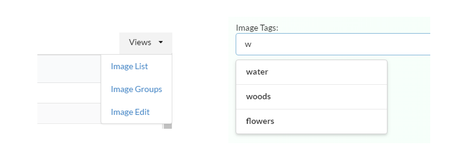

An astute observer has probably noticed that I’m using [jQuery](https://jquery.com/) in my
[Angular2](https://angular.io/) example [application](https://github.com/ng-cookbook/angular2-redux-complex-ui).

_"The horror! Revoke his Angular2 license now!!"_

I’m in no way saying this is a best practice or even a good practice. Including jQuery
is not required or even desirable for most Angular2 applications. Angular1 had
a dependency on jQuery or its own [jQuery-lite version](https://docs.angularjs.org/api/ng/function/angular.element),
but for Angular2 this is no longer the case.

jQuery will also cause problems for other scenarios, like pre-rendering the Angular2 application
on the server or in a web worker, because jQuery components are expecting to work with the physical DOM.
Plus it weights your application down with additional dependencies that will cause the application
to load more slowly for a user.

But using jQuery was practical for this situation and gives me the chance to demonstrate how Angular2
can interoperate with existing web technologies.  Let’s take a step back and look why jQuery
might be worth considering in certain scenarios.

## User Interface Widgets

There’s been much discussion about creating general purpose user interface components
(commonly called “widgets”). Think of widgets as resuable pieces of user interface that
can help you to build your application, for example, a progress bar, a dynamic and sortable table
view, menu bars, charts and graphs, etc. [Web Components](http://webcomponents.org/) are an example of
a standard that has been proposed to create general-purpose components like this.

But currently, the most popular standard for general-purpose components are ones based on
[jQuery](https://jquery.com/) (and its companion [jQuery UI](https://jqueryui.com/) library).
It will take a long time for the [vast collection](https://plugins.jquery.com/) of jQuery-based plugins
and user interface components to be implemented in some other form outside of jQuery.

Most of the Angular applications that I’ve written have had the need for some complex UI
components. I certainly could have addressed this by writing new components using Angular’s directive
syntax, but the goal of my projects has always been to create something
of value to the business, not to create user interface components. So it did not make sense for
me to recreate the wheel when existing components were available.  And most of the time, these
components were jQuery-based.

Fortunately, Angular has always had ways to interact with other components and has
generally “played well with others”. Angular2 is no different. In fact, a lot of the
strange syntax changes that you see in Angular2 come from ensuring that Angular2 works
consistently with all types of components, including web components, native elements,
or your own custom components.

## Angular2 Widgets

That said, there are a large number of Angular2-specific components in the works and the
need to use jQuery-based components will rapidly diminish. Web components may also become
popular. Other components are using a framework-agnostic approach by making use
of [DOM APIs directly](http://youmightnotneedjquery.com/).

As of this writing, there are options for Angular2 specific components, either in progress
or planned.

- [Google's Material Design](https://github.com/angular/material2)
- [Bootstrap 3/4](https://github.com/valor-software/ng2-bootstrap)
- [PrimeNG](https://github.com/primefaces/primeng)
- [Zurb Foundation](https://twitter.com/zurbfoundation/status/656927894401212416) _(a
    tweet saying that they have plans for Angular2, but nothing concrete yet)_
- [Kendo UI](http://www.telerik.com/blogs/kendo-ui-and-the-road-to-angular-2)
- [Semantic UI](https://github.com/vladotesanovic/ngSemantic)

## Widgets

In the [example application](https://github.com/ng-cookbook/angular2-redux-complex-ui),
I'm using a couple of widgets, a menu bar and
an auto-complete (type-ahead) component, which are implemented in the
[Semantic UI](http://semantic-ui.com/) library.  Semantic UI is a collection
of components that bills itself as "a development framework that helps create beautiful,
responsive layouts using human-friendly HTML." Currently Semantic UI has a dependency on
jQuery.



User interface widgets usually have either a global or explicit initialization. For global
initialization, once the page loads, markers are found in the page that identify elements
that should be initialized (for example, a class named `menu` might
initialize an application menu component).  Explicit initialization requires JavaScript
to explicitly initialize a specific element as a component. The latter is the type of
initialization that an Angular2 application will do. Page content is loaded dynamically
and the appropriate markup won't be available for any global initialization to find.

## Menu Widget

In Angular2, we create an [attribute directive](https://angular.io/docs/ts/latest/guide/attribute-directives.html)
to perform the explicit initialization of the menu widget.  Angular2 directives have
[life-cycle hooks](https://angular.io/docs/ts/latest/guide/lifecycle-hooks.html)
that can help us, specifically we will use the `ngOnInit` and `ngOnDestroy` hooks.

In the `ngOnInit` hook, we use jQuery on the element that the directive is attached
to in order to call the `dropdown()` initialization method. In the `ngOnDestroy` hook, we call
the `destroy` operation to remove the widget and to avoid any memory leaks.

```javascript
declare var $: any

@Directive({
    selector: '.ui.dropdown'
})
export class InitializeDropdown implements OnInit, OnDestroy {

    constructor(private el: ElementRef) {
    }

    public ngOnInit() {
        $(this.el.nativeElement).dropdown();
    }

    public ngOnDestroy() {
        $(this.el.nativeElement).dropdown('destroy');
    }
}
```

The directive we've created allows us to use jQuery in this way because we've also injected
the native DOM element into the directive (accessed through the `nativeElement` property of
the `ElementRef` dependency).  Be mindful, however, that this technique is considered to
be a "last resort".  Don't use the `nativeElement` property unless you need direct access to the
DOM (as we do in this case).

Note also that the selector for this directive, `.ui.dropdown`, is the same as the class names that
Semantic UI is using for the menu component itself.  So we didn't have to create a new attribute
property to associate this directive with an element and we don't have to change the markup.

```html
<div class="ui dropdown item">
    Views
    <i class="dropdown icon"></i>
    <div class="menu">
        <div class="item">
            <a [routerLink]="['/Images', 'List']">Image List</a>
        </div>
        <div class="item">
            <a [routerLink]="['/Images', 'Groups']">Image Groups</a>
        </div>
        <div class="item">
            <a [routerLink]="['/Images', 'Edit', {id: null}]">Image Edit</a>
        </div>
    </div>
</div>
```

However, we do have to include the name in the list of directives
known by the parent component (otherwise the directive will not get
instantiated).

```javascript
import {InitializeDropdown} from '../../directives/semanti-ui-init'

@Component({
    selector: 'title-bar',
    directives: [LoadingIndicator, RouterLink, InitializeDropdown],
    // ...
})
```

## Auto-Complete Widget

Another widget the example application uses is auto-complete (also called
“type-ahead”). We create another attribute directive similar to the
one for the menu component, but this time the initialization takes some
additional configuration and the directive will take an input parameter and emit
an event.

This directive wraps the underlying Sematic UI component, so we have the
ability to present the component to the overall application in a way that makes sense.  It
can easily expose all of the functionality of the underlying widget, but it could
also present a constrained API, more specific to the needs of the application itself.
It's good to consider the API that will be presented, especially in applications
with a lot of shared user interface components. We can present a component that only
exposes the things that a developer should change, rather than exposing the entire API
for the underlying widget. This makes for components that are easier to reuse and
helps ensure that the user interface is consistent.  This applies to jQuery-based
widgets (as in this example), but it could also be applied to more general-purpose
widgets implemented in Angular as well.

For the example application, we are wrapping the general-purpose auto-complete widget and
presenting it as a more specific image tag selector. It takes as an input property the list of all
distinct tags assigned to all of the images, and it exposes an event that is emitted when a
new tag is added.

```javascript
@Directive({
    selector: '[.ui.search]'
})
export class TagSelectorInput implements OnInit, OnDestroy {
    @Input() public tagsList: string[];
    @Output() public addTag: EventEmitter<any> = new EventEmitter();
    // ...
```

On initialization, the directive sets up the configuration for the auto-complete widget
which includes the list of tags. The configuration also includes handling the
item selected event (`onSelect`), which is translated into the `addTag` event emitted
by the directive.

```javascript
public ngOnInit() {
    let tagMap = this.tagsList.map(tag => ({ title: tag }))
    $(this.element)
        .search({
            source: tagMap,
            minCharacters : 1,
            onSelect: (result) => {
                this.onTagSelected(result.title)
            },
            // ...
        })
}

public onTagSelected(tag: string) {
    this.addTag.emit(tag)
    setTimeout(() => {
        $(this.element).search('set value', '')
        $(this.element).search('hide results')
    })
}
```

The `setTimeout` function clears the current contents of the input
control and ensures the auto-complete dropdown is hidden. The reason for doing this
within a `setTimeout` function is that this is sometimes required when modifying
properties of the widget itself while in a handler called by the widget. It basically
executes these operations within the next event loop, giving the widget time to finish
executing the handler.

Another feature we need is that when the user presses the `Enter` key while in the input
control, we want the current text to be added as a new tag. This is a feature that is not
directly supported by the auto-complete widget, but we can add this functionality
easily and have it work as a companion to the existing `tagSelectorInput` directive.

We create another attribute directive that will be applied to the input element
itself. It uses the `host` component definition to register a handler for the `keypress`
event.

```javascript
@Directive({
    selector: '[add-tag-on-enter]',
    host: {
        '(keypress)': 'onKeyPress($event)'
    }
})
export class AddTagOnEnter {
    // ...
```

We can also use Angular’s dependency injection system to inject the `tagSelectorInput`
directive into this directive.  This works because the `tagSelectorInput` directive
is a parent of the `AddTagOnEnter` directive.

```javascript
export class AddTagOnEnter {
    constructor(
        private el: ElementRef,
        @Optional() private tagSelectorInput: TagSelectorInput) {
    }
    // ...
```

Using the `@Optional` decorator specifies that this dependency is not required. Any code
that references the `tagSelectorInput` property should then check to see if is
actually defined before using it.

We respond to the keypress event by calling the `onTagSelected` method on the
`tagSelectorInput` component directly. The component can then emit the
`addTag` event just like when an existing tag is selected.

```javascript
public onKeyPress(evt) {
    if (evt && evt.code === 'Enter') {

        evt.preventDefault()
        evt.stopPropagation()

        let tag = this.el.nativeElement.value
        if (tag && this.tagSelectorInput) {
            this.tagSelectorInput.onTagSelected(tag)
        }
    }
}
```

This is a powerful technique in Angular2 applications that allows parent and child components
to work together nicely.
