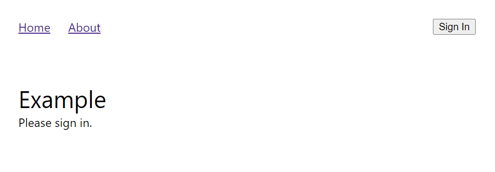

import styles from "./k8s-dapr-azure-identity-part-ii.module.css";

This post will step through building a simple, front end web application, deploying it to the Kubernetes cluster, then exposing it to the outside world via a Kubernetes Ingress.

The source related to this post is contained in the [`building-frontend-app`](https://github.com/dfbaskin/azure-and-dapr-identity-example/tree/building-frontend-app) branch of the repo.

## Building a Web Front End

To create the initial web application, we use [React](https://reactjs.org/), starting with [create-react-app](https://create-react-app.dev/) using the [Typescript template](https://create-react-app.dev/docs/adding-typescript). We will also use [react-router](https://reactrouter.com/web/guides/quick-start) to provide routes for navigation within the application.

We can use the `https://` protocol, even running the web application in "dev" mode, by adding some additional configuration to the `packages/browser-frontend/.env` file that brings in the certificates that we created previously.

```
BROWSER=none
HTTPS=true
SSL_CRT_FILE=../../certs/testing-local.crt
SSL_KEY_FILE=../../certs/testing-local.key
```

We can run the web application locally (using `npm start`) and then navigate to the address:

[`https://testing.local:3000/`](https://testing.local:3000/)

This gives us the additional benefit where changes to the code are automatically refreshed in the browser.

## Building the Front End Container Image

The next step is to build a [container image](https://kubernetes.io/docs/concepts/containers/images/) (using Docker) that will be deployed to the Kubernetes cluster.

We can build the web application assets by running the command:

```
npm run build
```

This builds the React application into a set of static files (including `index.html`, JavaScript, CSS, and other files). These files will be served to a client (a browser). A popular mechanism to do this is using the open-source [NGINX](https://docs.nginx.com/nginx/admin-guide/installing-nginx/installing-nginx-open-source/) package.

The `packages/browser-frontend/Dockerfile` describes the container to build using a pre-existing NGINX image. It also describes copying the web assets from the build and an `nginx.conf` configuration file to the image.

```
FROM nginx:latest
COPY ./deploy/frontend-nginx.conf /etc/nginx/nginx.conf
COPY ./build/ /var/www/site/
```

In the web application, two routes are included, one to the root (`/`) and one to an "About" page (`/about`). When serving content for a SPA web site, the server needs to recognize that the "About" page really comes from the default `/index.html` file (not from an `/about.html` or `/about/index.html` file). So the NGINX configuration, specified in `packages/browser-frontend/deploy/frontend-nginx.conf`, includes definitions to map routes back to the correct content.

```
http {
  include mime.types;
  sendfile on;
  server {
    listen 80 default_server;
    root /var/www/site;
    index index.html index.htm;
    location ~* \.(?:manifest|appcache|html?|xml|json)$ {
      expires -1;
    }
    location ~* \.(?:css|js)$ {
      try_files $uri =404;
      expires 1y;
      access_log off;
      add_header Cache-Control "public";
    }
    location ~ ^.+\..+$ {
      try_files $uri =404;
    }
    location / {
        try_files $uri $uri/ /index.html;
    }
  }
}
```

Use this script to build the static web site and the container image:

`packages/browser-frontend/deploy/build-frontend-image.ps1`

To incorporate this image into Kubernetes, the following configuration is used to define a [deployment](https://kubernetes.io/docs/concepts/workloads/controllers/deployment/) and a [service](https://kubernetes.io/docs/concepts/services-networking/service/).

```
apiVersion: apps/v1
kind: Deployment
metadata:
  name: frontend-deployment
spec:
  selector:
    matchLabels:
      app: frontend
  replicas: 1
  template:
    metadata:
      labels:
        app: frontend
    spec:
      containers:
        - name: nginx
          image: frontend-webserver:v1.3
          imagePullPolicy: Never
          ports:
            - containerPort: 80

---
apiVersion: v1
kind: Service
metadata:
  name: frontend-service
spec:
  selector:
    app: frontend
  ports:
    - name: http
      protocol: TCP
      port: 80
      targetPort: 80
```

The deployment describes the state of the [pod](https://kubernetes.io/docs/concepts/workloads/pods/) including the container image to be used. The service then exposes the deployment as a network service within the cluster.

The following scripts can be used to initialize these components:

- `packages/nginx-ingress/create-namespace.ps1` - creates a separate [namespace](https://kubernetes.io/docs/concepts/overview/working-with-objects/namespaces/) in which to install the example application. This makes deleting the entire application from Kubernetes easier.

- `packages/browser-frontend/deploy/initialize-frontend.ps1` - applies the configuration for the front end application using the image that was built previously.

We can now verify that the front end application is running with a few commands:

```
> kubectl get deployment -n azure-dapr-identity-example
NAME                  READY   UP-TO-DATE   AVAILABLE   AGE
frontend-deployment   1/1     1            1           62s

> kubectl get service -n azure-dapr-identity-example
NAME               TYPE        CLUSTER-IP       EXTERNAL-IP   PORT(S)   AGE
frontend-service   ClusterIP   10.103.234.151   <none>        80/TCP    81s

> kubectl get pod -n azure-dapr-identity-example
NAME                                   READY   STATUS    RESTARTS   AGE
frontend-deployment-68dbc6f5dd-2qj82   1/1     Running   0          4m5s

> kubectl port-forward service/frontend-service 32001:http -n azure-dapr-identity-example
Forwarding from 127.0.0.1:32001 -> 80
Forwarding from [::1]:32001 -> 80
```

The last command temporarily forwards requests from your local machine on port 32001 to the `http` (80) port of the `frontend-service` (press `Ctrl`+`C` to stop it). Navigate in a browser to [http://localhost:32001/](http://localhost:32001/) and you should see the web application.

<div className={styles.browserPage}>



</div>

The application doesn't do anything interesting, yet, but you can navigate to the two routes. Refreshing the page returns the correct content as well.

## The NGINX Ingress Controller

An [Ingress](https://kubernetes.io/docs/concepts/services-networking/ingress/) allows the outside world to interact with services within the Kubernetes cluster. The [IngressClass](https://kubernetes.io/docs/concepts/services-networking/ingress/#ingress-class) defines configuration for a particular type of ingress including the type of [Controller](https://kubernetes.io/docs/concepts/services-networking/ingress-controllers/) that implements the class.

In our example, we are using the [NGINX Ingress Controller](https://docs.nginx.com/nginx-ingress-controller/overview/) for Kubernetes.

> _Note that this ingress controller is different from the [NGINX Ingress Controller](https://kubernetes.github.io/ingress-nginx/) maintained by the Kubernetes team. The differences are documented [here](https://github.com/nginxinc/kubernetes-ingress/blob/master/docs/nginx-ingress-controllers.md)._

The simplest way to use this ingress controller is using a [Helm](https://helm.sh/) chart. We customize the chart with some annotations:

```
controller:
  name: example-app-ingress
  healthStatus: true
  defaultTLS:
    cert: $CERT_VALUE
    key: $KEY_VALUE
  service:
    httpPort:
      port: 31002
      targetPort: 80
    httpsPort:
      port: 31001
      targetPort: 443
```

And use the following script

```
packages/nginx-ingress/initialize-nginx-ingress.ps1
```

to update `$CERT_VALUE` and `$KEY_VALUE` properties with a base-64 encoded version of the certificate and private keys we created previously and then apply the chart to the Kubernetes cluster.

Finally, we use the Ingress definition to map requests coming into the Ingress Controller to the front end application:

```
apiVersion: networking.k8s.io/v1
kind: Ingress
metadata:
  name: frontend-ingress
spec:
  ingressClassName: nginx
  tls:
    - hosts:
        - testing.local
      secretName: example-app-ingress-nginx-ingress-default-server-tls
  rules:
    - host: testing.local
      http:
        paths:
          - path: /
            pathType: Prefix
            backend:
              service:
                name: frontend-service
                port:
                  number: 80
```

The `frontend-service` exposes the static web site within the Kubernetes cluster. This ingress defintion routes requests that match the `testing.local` domain and requested paths to the web site service. In our case we are just sending all incoming requests to `frontend-service`. We'll add a Web API later that will be another destination for routed traffic.

This definition will also configure [TLS-termination](https://en.wikipedia.org/wiki/TLS_termination_proxy) for us. An incoming request from outside the cluster will be encrypted, but within the cluster the requests can flow to the service unencrypted (over the `http` protocol). We will discuss later how this changes once we incorporate DAPR services.

This ingress definition can be applied using the command:

```
kubectl apply -f frontend-ingress.yaml -n azure-dapr-identity-example
```

Once this is all configured, you can navigate in the browser to the application at [https://testing.local:31001/](https://testing.local:31001/).
