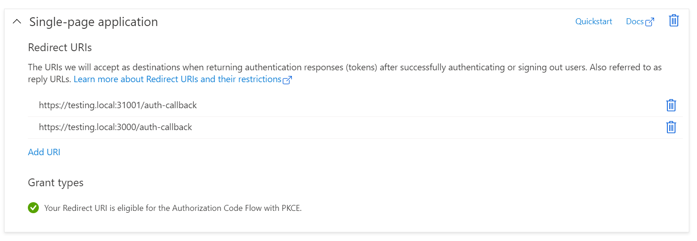
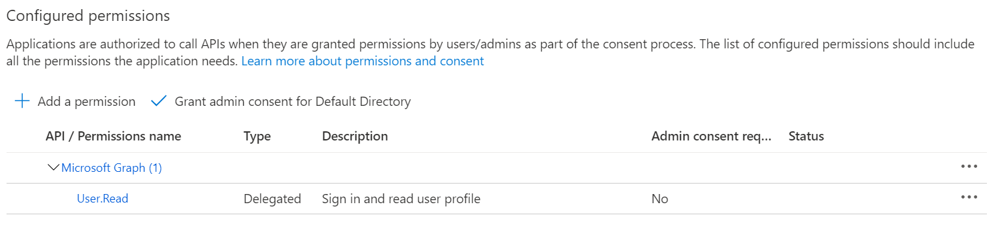

This post will step through setting up user authentication using Azure Active Directory.

The source related to this post is contained in the [`adding-authentication`](https://github.com/dfbaskin/azure-and-dapr-identity-example/tree/adding-authentication) branch of the repo.

## Creating an AAD Application

We will need to regiser an application with Azure Active Directory. The following are links to comprehensive documentation about this process.

- [Microsoft Identity Platform](https://docs.microsoft.com/en-us/azure/active-directory/develop/v2-overview) - this is an overview of services that Microsoft provides for managing user identity.

- [SPA Web Site](https://docs.microsoft.com/en-us/azure/active-directory/develop/scenario-spa-overview) - our application is a [SPA](https://developer.mozilla.org/en-US/docs/Glossary/SPA) implementation. It will use the [OAuth 2.0 Authorization code flow (with PKCE)](https://docs.microsoft.com/en-us/azure/active-directory/develop/v2-oauth2-auth-code-flow) to authenticate a user and call web APIs.

- [Registering a Web Application](https://docs.microsoft.com/en-us/azure/active-directory/develop/scenario-spa-app-registration) - instructions for creating a web application which uses MSAL.js 2.0 or greater.

- [On-Behalf-Of Flow](https://docs.microsoft.com/en-us/azure/active-directory/develop/v2-oauth2-on-behalf-of-flow) - this describes how API calls can be made by a web server on behalf of an authenticated user.

Specifically, to configure the example application:

- Update the `packages/browser-frontend/src/services/ConfigService.ts` file to include the client id and [authority](https://docs.microsoft.com/en-us/azure/active-directory/develop/msal-client-application-configuration#authority) used for authentication.

```
export function fetchAuthConfig(): Promise<AuthConfig> {
  return Promise.resolve({
    clientId: "f7edc002-e261-42e5-9140-8dde2e83260c",
    authority:
      "https://login.microsoftonline.com/fa1ee923-839f-4da5-a453-6eefaf3c9699/",
  });
```

- Update the "Single page application" redirect URLs to point to the `testing.local` domain we've configured on the `/auth-callback` path.



- Ensure that the Microsoft Graph `User.Read` API permission is enabled.



## User Authentication

We use the [Microsoft Authentication Library for JavaScript](https://github.com/AzureAD/microsoft-authentication-library-for-js#readme) within the front end application. This is part of Microsoft’s Identity Platform and has the tools for authenticating the user and requesting access tokens.

The additional code within this example application wraps the MSAL authentication library into a state machine, powered by [XState](https://xstate.js.org/docs/), as well as a [React Context](https://reactjs.org/docs/context.html) that wraps the state machine and allows UI components to access the machine. However, the authentication flow itself is handled by the MSAL library (found in `packages/browser-frontend/src/services/AuthService.ts`).

A client-side route `/auth-callback` is used to allow the MSAL library to handle the redirects from the authentication service and then redirect back to the main page.

## Testing Authentication and the Microsoft Graph API

Once you've configured the application, you can start it (in "dev" mode) using `npm start`. Navigate to `https://testing.local:3000/` and sign into the application.

The application can also call the "Me" method from the [Microsoft Graph API](https://docs.microsoft.com/en-us/graph/overview). The following function retreives the access token for the `User.Read` scope and passes it on to the "Me" endpoint.

```
export function fetchMeFromBrowser() {
  return getUserDetails()
    .then((details) => {
      if (!details.isAuthenticated) {
        throw new Error("User is not signed in.");
      }
      const { bearerToken } = details;
      return fetch("https://graph.microsoft.com/v1.0/me", {
        method: "get",
        headers: new Headers({
          Authorization: `Bearer ${bearerToken}`,
        }),
      });
    })
    .then((rsp) => {
      if (!rsp.ok) {
        throw new Error(`Request was not successful (HTTP: ${rsp.status})`);
      }
      return rsp.json();
    });
}
```

We can also update the container image for the web application to use within the Kubernetes cluster by running the build and initialization scripts again:

```
packages/browser-frontend/deploy/build-frontend-image.ps1
packages/browser-frontend/deploy/initialize-frontend.ps1
```

Then navigate to the Kubernetes ingress endpoint, [https://testing.local:31001/](https://testing.local:31001/).

Next up, we'll create a back end web API for the front end application to use, including verifying the identity of the user and making a request to the Microsoft Graph API on behalf of the user.
