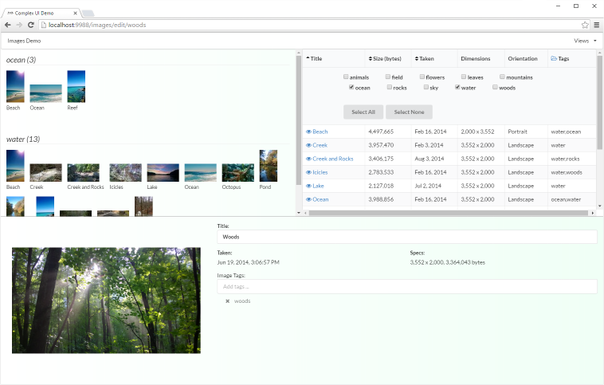

When I first started using [AngularJS](https://angularjs.org/) (way back in version 0.8, I believe),
I was continually impressed at what it
could do. The team I was working with at the time had many discussions on how this young framework could be used
effectively within our project. We found ourselves experimenting with different techniques and slowly figuring out
what patterns worked best. We were rewarded with many “Aha!!” moments that showed us how much insight went into the
framework.

As you probably already know, there’s a [new version of AngularJS](https://angular.io/) that is close to being released.
The Angular team basically took
a step back and considered all the things they learned building Angular1, many ideas and techniques that came about
as browser technology matured, and advances to Javascript itself (ES2015 and TypeScript), and rewrote the framework
to be a better platform for creating modern web applications.

I’ve spent some time working with the new Angular2 framework and now have a better sense of how it is used. I think
the Angular team has done a great job of improving the framework.

I've built an example application to manage a list of images. It’s not a full featured application, but I wanted to
build something that had a reasonably complex user interface and also incorporated routes and UI controls (and wasn’t a
To-Do application). I also wanted to explore new ways to deal with application state using
[immutable data](https://facebook.github.io/immutable-js/) and
[Redux](http://redux.js.org/).

The source code is [here](https://github.com/ng-cookbook/angular2-redux-complex-ui).

This is the first post of a series digging into the implementation details of this Angular2/Redux application. But
before getting into these details, a little overview first.

## Big Ideas

There’s been a lot of talk lately about “Javascript Fatigue”. There is so much rapid change, new libraries, and
conflicting ideas around creating Javascript-based applications (whether they are web applications, NodeJS, Electron,
etc.) that developers are overwhelmed by all the options. It’s exhausting just trying to keep up.

I can definitely understand these feelings, but I read this a little bit differently. Yes, there is a confusing mash
of options available and it is hard to tell which ones are important and should receive our attention. But there are
also a lot of big ideas being discussed in public, open forums about how best to build applications. Ideas are being
put out there, debated, refined, and tested. To me, it’s actually pretty interesting. It’s hard to keep up, but I do
think folks are gathering around several big ideas that benefit us as developers.

## Functional Programming

Functional programming has been around for a while and its benefits are well known. Since
[React](https://facebook.github.io/react/) has become
popular, developers are starting to understand it more as a functional paradigm. A developer benefits from creating
stateless components and passing in `props`, so that a React component becomes more like a function, data goes in
and HTML markup comes out. Other frameworks like [CycleJS](http://cycle.js.org/) make the functional nature
of the framework more explicit.
Languages like [Elm](http://elm-lang.org/) fully embrace a functional paradigm.

Angular2 does not go down the functional path, it still uses the declarative model in HTML that we had in Angular1
(with some [significant syntax changes](https://angular.io/docs/ts/latest/guide/template-syntax.html), though).
However, Angular2 has greatly improved how user interface is organized
and rendered, which was influenced by React, especially in the idea of organizing your application into components.

## Components

[React](https://facebook.github.io/react/) and [Web Components](http://webcomponents.org/)
have popularized the idea of organizing your application into components, specifically a
tree of components, starting at a root and working through the tree to more specialized components. Larger components
can be assembled from smaller components, which makes understanding, writing, and testing the pieces of your
application much easier.

Components can be further categorized as well. A common way to think about components is to separate them into
two categories, components that organize and orchestrate application logic and components
that present user interface with inputs and outputs. This distinction is sometimes called “smart”
and “dumb” components.

Container components coordinate the presentation components, application logic, and service interactions that make up
your application. Presentation components can be reused and don’t know anything about the overall application. They
take input data and generate output data through events, which are handled by the container components.

This allows you to think about your application in more narrowly focused pieces. If application components get too heavy (too
much code), you can refactor to divide up functionality in more manageable chunks.

Since components are organized into a tree, then another important idea comes into play.

## Unidirectional Data Flow

One of the problematic areas of Angular1 was the way model changes were handled.
A [digest loop](https://docs.angularjs.org/guide/scope#scope-life-cycle) looked for changes to
model data, but a change in a data item could trigger other changes as well, requiring another round of change
detection. Too many iterative changes and you see the dreaded `$digest() iterations reached. Aborting!` error.

This also made it very hard to reason about how changes really affected your application.

In Angular2, the
[strategy for change detection](http://blog.thoughtram.io/angular/2016/02/22/angular-2-change-detection-explained.html)
has changed. Changes in model data start from the top and work down
through the tree of components. There is no longer any digest loop, it’s just a single pass through the tree. This
makes understanding the effects of changes to model data much clearer.

Another advantage of this is that while traversing down through the tree, if the data associated with a component
hasn’t changed, then there shouldn’t be any changes in the user interface defined by the component and its children.
These components do not have to be rendered again and can be skipped. This provides for some nice rendering
optimizations that allow for better performance and responsiveness for the end user.

To ensure that data associated with a component has not changed, the idea of immutable data really helps.

## Immutable Data

If your model data is an object or an array, changes can occur anywhere within the model data. Therefore, you are not
sure whether the model itself has changed unless you check for changes throughout the model’s data, such as object
properties, child objects, or array entities.

This caused a problem in Angular1. For change detection, watchers were set up on
data elements to determine what model data had changed. With a large set of watchers, application
performance would suffer.

With [immutable data objects](https://facebook.github.io/immutable-js/), change detection becomes very easy.
An immutable data object means that the reference to
the object and all of the object's properties and children will not change. Once they are set they cannot be changed
unless a new object is created that merges the original object properties with the changes. But at this point, it
is a new object and this object has a different reference. So the test
for whether an immutable object has changed simply boils down to an equality test.

```javascript
let modelHasChanged = myNewReference !== myPreviousReference;
```

Angular2 can [use this concept](http://victorsavkin.com/post/110170125256/change-detection-in-angular-2)
to know when model data has changed so that it can determine whether a component should
be rendered again (specified using the `OnPush`
[ChangeDetectionStrategy](https://angular.io/docs/js/latest/api/core/ChangeDetectionStrategy-enum.html)).

Another benefit of using immutable data is that it helps us to avoid unintended changes to our application state.
However, we can also take it a step further and consider a more concise way to manage our application state altogether.

## Application State (Redux)

An application transitions between different states based on some stimulus, like a user pressing a button, a message
being received, or whatever. It’s important to understand what should happen when the application transitions from
one state to another. This is especially true for an application that has any reasonably complex user interface. Too
often applications devolve into unmanageable mess of message handling and data changes as the application
grows in complexity.

If we separate our application state from our user interface and manage it more concisely, we can better understand
how our application works and more safely update and improve it. We can move the handling of application state
changes to its own system to isolate it from the rest of the application.

[Redux](http://redux.js.org/) is a popular example of doing exactly this. It defines an application store,
reducers, and actions that your
application uses to handle its state transitions. All application state changes go
through a [very prescriptive pattern](https://code-cartoons.com/a-cartoon-intro-to-redux-3afb775501a6#.2jdssbet4).
The benefit is that application state is centrally located and tightly
controlled. Components pass actions to the application store, where reducers make the application state changes,
and then components subscribe to application state changes and render themselves based on the current
application state.

Redux is popular in the React community, but it can be easily be used in Angular2 applications as well (as I’ve done
in this example application).

React reducers are intended to be pure functions (no side effects). However, Angular2 application still need to
retrieve data from a remote source and invoke other kinds of asynchronous operations. One more idea revolves around
how to deal with these operations.

## Observables

[Observables](http://reactivex.io/rxjs/manual/overview.html#observable) are a robust way
to handle streams of asynchronous events. [RxJS](https://github.com/ReactiveX/rxjs),
a popular implementation of the observable pattern,
provides a set of functions that allow
you to orchestrate, transform, and otherwise manipulate asynchronous events that
come from a variety of sources. RxJS describes itself as “LoDash for events”
([LoDash](https://lodash.com/) is a popular set of general-purpose utilities for
Javascript).

A good way to think about RxJS in particular is that it is a mechanism to describe a series of asynchronous
operations. In other words, it allows you to declaratively define exactly how a stream of events should be handled
to better understand asynchronous operations.

Angular2 makes extensive use of Observables. The
[HTTP service](https://angular.io/docs/ts/latest/guide/server-communication.html) for example,
now returns an observable instead of a promise.

This is a significant change, but why was it required? Because observables have a few advantages over promises.

- Observables only activate when a subscription to the observable is created. In other words, they are “lazy”. The
  operation associated with a promise is activated when the promise is first created.

- Observables can be canceled. There are ways to cancel a promise, but generally involve creating a “back door” into
  the operation the promise wraps. Being able to cancel, for example, an HTTP request allows for more robust
  applications.

- Promises can be chained together, allowing you to transform the results of a promise operation in interesting ways,
  but Observables have even more capability. Observables can be used to orchestrate asynchronous operations in ways
  much more diverse than simple promise chains.

If for some reason, however, you still need or want to use promises in your own application, it is a simple matter to
wrap the output of an observable in a promise that can then be provided to other parts of your application.

## Example Application



The application I created, [found here](https://github.com/ng-cookbook/angular2-redux-complex-ui), allowed
me to explore some of the ideas above. Subsequent posts will dive into
the details of the implementation. I hope to give you some insight into the power of the Angular2 framework and what
can be accomplished with it.

I am very excited about the changes in Angular2 and I think it will continue to be a robust platform for building web
applications.
