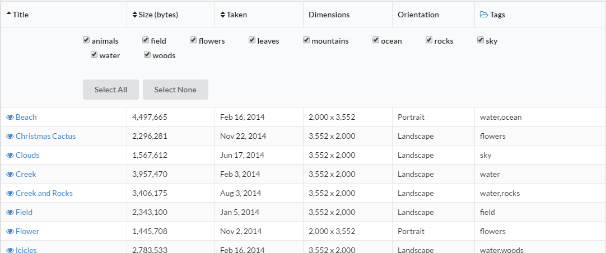
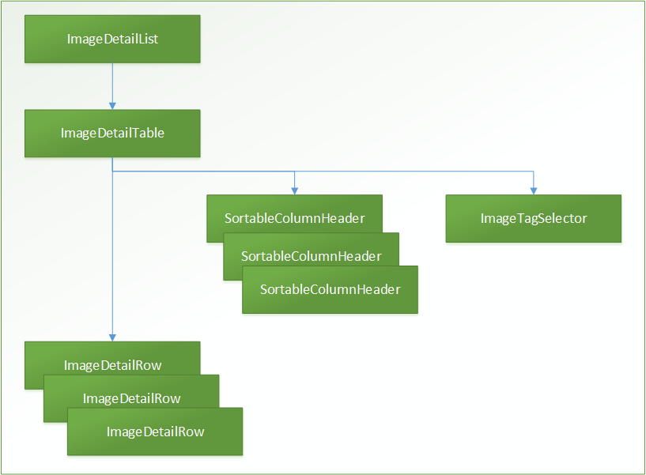

[Angular2](https://angular.io/) has a strong emphasis on components. An application is made up
of a tree of components, starting from the root component and working down to child components.
This helps to organize your application into logical and manageable pieces. Complex user interface
can be broken down into smaller components, assembling them together, to better organize
your application's functionality and how it is presented to the user.

Components can be further categorized. Some components are just simple user interface
components, for example like a date-picker widget or a simple user information card.
These components are used throughout your application, but they don't exercise
your application logic. That work is delegated to other parts of the application.
These components might be called "Presentation" (or "Dumb") components.

Other components serve to organize and orchestrate the activities of child components and
application services. These components know about the application logic. They might
push application data down to child components and respond to events emitted by them.
They might transform an event into a transition to a new application state. These components
might be called "Container" (or "Smart") components.

## Example Application Components

Let's look at how some of the components in the
[example application](https://github.com/ng-cookbook/angular2-redux-complex-ui) are
organized. Of course, you might organize your components differently, but it at least gives
us a base for discussion.

We'll examine the components that go into one area of the application, the list of images.



This component displays a simple table of all the images in the collection. Column headers
are sortable, the row contains a link to view the image, and the expanding the "Tags"
column header allows the user to select a subset of images to be displayed based on
tags they have been assigned.

Now you could certainly implement all of this functionality as a single component. But you would find
that the component becomes too "heavy"; it's trying to do too many things. For the example, I broke
down this functionality into the following components:

- [ImageDetailList](https://github.com/ng-cookbook/angular2-redux-complex-ui/blob/master/src/app/components/image-detail-list/image-detail-list.ts) -
  the images list component (the main parent component).
- [ImageDetailTable](https://github.com/ng-cookbook/angular2-redux-complex-ui/blob/master/src/app/components/image-detail-list/image-detail-table.ts) -
  the table itself.
- [ImageDetailRow](https://github.com/ng-cookbook/angular2-redux-complex-ui/blob/master/src/app/components/image-detail-list/image-detail-row.ts) -
  a row within the table.
- [SortableColumnHeader](https://github.com/ng-cookbook/angular2-redux-complex-ui/blob/master/src/app/components/image-detail-list/sortable-column-header.ts) -
  a sortable table column header.
- [ImageTagSelector](https://github.com/ng-cookbook/angular2-redux-complex-ui/blob/master/src/app/components/image-detail-list/image-tag-selector.ts) -
  the image tag selector

I'll get into the mechanics of using Redux to manage application state in future post, but of the components
above, only two of them work directly with the application state. The `ImageDetailList` component
needs the collection of images and the `ImageTagSelector` needs the collection of all tags associated
with the images. The remaining components have data passed into them (through `Input` parameters) and
tell the parent component that some event has happened (thought `Output` event emitters).

The components can be viewed as a hierarchy, a tree of components.



Let's walk down the tree of components and dig into how they work together.

## ImageDetailList - The Main Image Detail List Component

This is the main container component for displaying the list of images. Note that you shouldn't think
that only "widget" user interface controls and other presentation components can be reused within your application.
This image list component can stand by itself and is reused within the the "Image List", the "Image Groups",
and "Image Edit" views of the application.

This component is included within the application using HTML markup.

```html
<image-detail-list></image-detail-list>
```

Using this markup by itself, however, is not sufficient to instantiate the component and include it in the page
rendering. Any component that includes this component needs to know about it. This is done using
the `directives` property on the `@Component` annotation.

```javascript
import {ImageDetailList} from '../../image-detail-list/image-detail-list'

@Component({
    directives: [ImageDetailList],
    ...
})
```

Adding the import and component class to the parent definition notifies Angular that the component
will be included.

_(This will probably be a very common issue that developers using Angular2 will encounter.
"Why is my component not showing up?", "Did you include it the component definition?",
"Arrghh!!", Smacks forehead.)_

This `ImageDetailList` component uses the `ImageDetailTable` component as a child component, which is
declared using HTML markup.

```html
<image-detail-table [tableData]="imageList" [sortBy]="sortBy" [isAscending]="isAscending" (toggleTitleSort)="sortByTitle()" (toggleSizeSort)="sortBySize()" (toggleDateSort)="sortByDate()"></image-detail-table>
```

This may be like no HTML markup you've ever seen, but it is valid markup. The documentation
for this [template syntax](https://angular.io/docs/ts/latest/guide/template-syntax.html) will help to
better understand this. Ultimately, however, what is going on here is that the child component,
`ImageDetailTable`, exposes an API that the parent component, `ImageDetailList`, is using. It is
binding its own data to API properties of the child component and responding with its own
methods when events occur on the child component.

This is a great feature of Angular2. It makes the interface to your components much more explicit,
and much easier to use.

Note also that the child component is a custom component that we've created. But this same API interface
applies to regular HTML markup elements as well. Elements have properties and expose events
and our Angular2 components work with them exactly as they do with custom components. In other
words there is a very consistent interface for working with the elements within your web page,
regardless what type they are, native element, custom components, or web components.

## ImageDetailTable - Image List Table Component

So how does the API that `ImageDetailTable` exposes actually work? The component requires some
inputs, specifically:

- the list of images
- how the images are currently sorted
- and whether they are sorted in ascending or descending order.

It also exposes some events, specifically, an event is emitted whenever the user chooses
to sort by a particular column in the table.

So another way to think about this is that everything that the `ImageDetailTable` needs
is passed to it through inputs, and everything that it does passes back out as outputs. It really
knows about nothing else. This also makes it a presentation (or "dumb") component.

The `ImageDetailList` component passes the data to the `ImageDetailTable` component through
input bindings. It also registers a callback method for each of the emitted events
through output bindings. These are defined in the component using:

```javascript
@Input() public tableData: any;
@Input() public sortBy: ImageSortBy;
@Input() public isAscending: boolean;
@Output() public toggleTitleSort: EventEmitter<any> = new EventEmitter();
@Output() public toggleSizeSort: EventEmitter<any> = new EventEmitter();
@Output() public toggleDateSort: EventEmitter<any> = new EventEmitter();
```

These declare properties on the component class that can be used as bindings for a
parent component. This also makes it clear what the component expects as input
and what it emits as output, i.e., the component's API.

The component can then use these properties just like other
properties on the class. For example, the `tableData` property is used to
render each row of the table.

```javascript
<tbody>
  <tr class="image-detail-row" *ngFor="#rowData of tableData" [rowData]="rowData"></tr>
</tbody>
```

For events, let's look at the column headers.

## SortableColumnHeader - The Sortable Column Component

The `SortableColumnHeader` component is used in a column header to provide user interface
for sorting the column in ascending or descending order. It's a general component and really
knows nothing about what it is sorting. It's just a button along with an indicator that the
column is being sorted.

The markup for this component uses the sort state to indicate what icon should be displayed. It also
uses an `ng-content` element so that the additional content associated with column header can be
displayed.

```html
<div (click)="onHeaderClicked($event)" style="cursor: pointer;">
  <span *ngIf="sortIndicator < 0"><i class="fa fa-sort-desc"></i></span>
  <span *ngIf="sortIndicator > 0"><i class="fa fa-sort-asc"></i></span>
  <span *ngIf="sortIndicator === 0"><i class="fa fa-sort"></i></span>
  <ng-content></ng-content>
</div>
```

The markup also uses event binding to specify a method that should be called when the user
clicks on the sort icon. _(Note that the above technique is not very
[accessible-friendly](https://developer.mozilla.org/en-US/docs/Web/Accessibility/ARIA/ARIA_Techniques/Using_the_button_role).)_

The component translates this click event into the specific event, `toggleSort`, that the component
itself publishes.

```javascript
@Output() public toggleSort: EventEmitter<any> = new EventEmitter();

public onHeaderClicked(event) {
    event.preventDefault();
    this.toggleSort.emit(null);
}
```

The `ImageDetailTable` specifies bindings to the `SortableColumnHeader` properties. It provides the
current sort state of the column and binds the the `toggleSort` event for the column. In the example
application three of the columns can be sorted.

```html
<th class="sortable-column-header" [sortIndicator]="titleSortIndicator" (toggleSort)="sortByTitle()">Title</th>
<th class="sortable-column-header" [sortIndicator]="sizeSortIndicator" (toggleSort)="sortBySize()">Size (bytes)</th>
<th class="sortable-column-header" [sortIndicator]="dateSortIndicator" (toggleSort)="sortByDate()">Taken</th>
```

The `ImageDetailTable` then translates the toggle sort events into its own specific events.

```javascript
@Output() public toggleTitleSort: EventEmitter<any> = new EventEmitter();
@Output() public toggleSizeSort: EventEmitter<any> = new EventEmitter();
@Output() public toggleDateSort: EventEmitter<any> = new EventEmitter();
```

These events ultimately get handled by the `ImageDetailList` component, the root
component in the hierarchy of components. It knows more about the application state and
what should actually happen when the user sorts a column. In this case it creates an action
to submit to the Redux application store. _(We'll cover working with Redux and the application
state in a future post.)_

```javascript
public sortByTitle() {
    this.appStore.dispatch(sortImages(ImageSortBy.title, this.sortAscending(ImageSortBy.title)))
}

public sortBySize() {
    this.appStore.dispatch(sortImages(ImageSortBy.size, this.sortAscending(ImageSortBy.size)))
}

public sortByDate() {
    this.appStore.dispatch(sortImages(ImageSortBy.date, this.sortAscending(ImageSortBy.date)))
}
```

So, the application responds to the user initiated event, selecting a column to sort by, by
bubbling up the event through the component tree, transforming the event as necessary, and
ultimately having the parent component do something with it.

## ImageDetailRow - A Table Row with Image Details

The `ImageDetailRow` component handles generating a row of image details within the table.
The table uses `*ngFor` to generate the table row (the `<tr>` element). In the markup below
for using this component, `#rowData` specifies a variable that can be used elsewhere.
We then use this variable to pass the image data into the `rowData` input property on
the `ImageDetailRow` component.

```javascript
<tbody>
  <tr class="image-detail-row" *ngFor="#rowData of tableData" [rowData]="rowData"></tr>
</tbody>
```

Markup in an table is a bit more constrained than other HTML markup, so we don't want to use a
custom HTML element for the detail row component. In this case we use a different selector, one
that selects the `image-detail-row` CSS class. The template for the row then consists of
the table data elements (`<td>`) within the row. It makes the assumption that the
component would only be included within an HTML table row (a `<tr>` element).

```javascript
@Component({
    selector: '.image-detail-row',
    directives: [RouterLink],
    template: `
        <td>
            <a [routerLink]="imageRouteFor(rowData)">
                <i class="fa fa-eye"></i> {{rowData.title}}
            </a>
        </td>
        <td>{{rowData.size | number}}</td>
        <td>{{rowData.dateTaken | date}}</td>
        <td>{{rowData.width | number}} x {{rowData.height | number}}</td>
        <td>{{rowData.portrait ? "Portrait" : ""}}{{rowData.landscape ? "Landscape" : ""}}</td>
        <td>{{rowData.tags}}</td>
    `
})
```

If you have experience with Angular1, then you'll notice that the binding and filters that
you used previously are still available in Angular2. However, filters have been enhanced and
and now called [pipes](https://angular.io/docs/ts/latest/guide/pipes.html).

The `[routerLink]` property in the anchor tag above adds an application route, which we'll
also cover in a future post).

## ImageTagSelector - Selecting Image Tags to Include

Finally, the `ImageTagSelector` component is used to select a subset of images to display based on tags
that have been assigned to all of the images. This component deals with the application state
directly rather than being a presentation component (though it certainly could have
been implemented that way).

When thinking about how best to organize the components in your own application, there will
always be trade-offs. Organize your components that make the best sense for the application
and the team. I try to be pragmatic, since as developers we are trying to deliver business value.

This component subscribes to the application store and publishes actions to the store.
Using Redux, however, tends to isolate your component and makes it easier to
refactor later, if necessary.

A set of checkboxes is generated that includes the current list of tags associated with all of the
images in the collection.

```html
<label>
  <input #tagInput type="checkbox" [ngModel]="tag.isSelected" (ngModelChange)="toggleSelectedTag(tag.tag, tagInput.checked)" />
  {{tag.tag}}
</label>
```

When checkboxes are toggled, a new list of excluded tags is generated and an action is
created for the application store to change the excluded tags state.

```javascript
public toggleSelectedTag(tag, isSelected) {
    this.imageTags = this.imageTags.map(v => isMatchingTag(v.tag, tag) ? {tag, isSelected} : v)
    this.onSelectionChanged()
}

private onSelectionChanged(): void {
    let excludedTags = getExcludedTagsFromSelectedTagsList(this.imageTags);
    this.appStore.dispatch(excludeImageTags(excludedTags))
}
```

Hopefully this gives you a sense of how components can be used within an Angular2 application.
