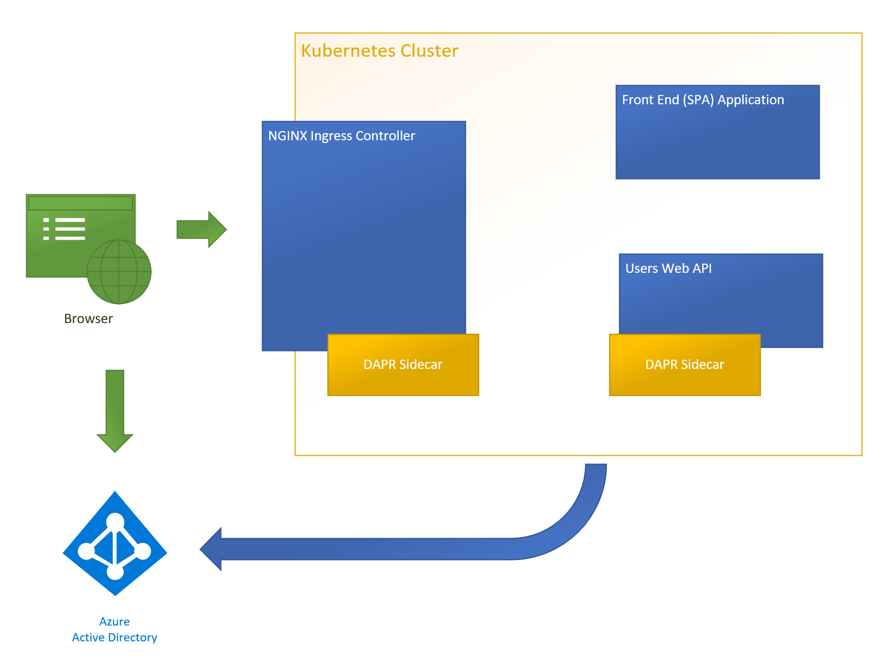

## Introduction

In this series of posts, we will step through setting up a static web site ([SPA](https://developer.mozilla.org/en-US/docs/Glossary/SPA)), user authentication using [Azure Active Directory](https://docs.microsoft.com/en-us/azure/active-directory/fundamentals/active-directory-whatis) (AAD), simple authenticated services, all within a [Kubernetes](https://kubernetes.io/docs/concepts/overview/what-is-kubernetes/) cluster using [DAPR](https://dapr.io/) services.

The source code is located at [https://github.com/dfbaskin/azure-and-dapr-identity-example](https://github.com/dfbaskin/azure-and-dapr-identity-example). There are separate branches related to the different posts.

This example was built on my Windows 10 development machine, but should also work for other environments. The requirements for building this example on your local machine are:

- [Docker and Kubernetes](https://www.docker.com/products/docker-desktop) - Docker is used to build the container images for deployment into the Kubernetes cluster.

- [Helm](https://helm.sh/docs/) - To install the [NGINX Ingress controller](https://github.com/nginxinc/kubernetes-ingress).

- [Powershell](https://docs.microsoft.com/en-us/powershell/) - Scripts included in the example are written in Powershell, which is available cross platform. The scripts, however, are all fairly simple and could easily be migrated to the scripting language of your choice if so desired.

- [.NET Core v5 SDK](https://dotnet.microsoft.com/download) - The Web API is created using C# and the .NET runtime.

- [Node JS](https://nodejs.org/en/) - The front end application is written using [React](https://reactjs.org/) and [TypeScript](https://www.typescriptlang.org/) and Node is used to build it.

## Microservices

Kubernetes works by examining a desired configuration of [services and other resources](https://kubernetes.io/docs/concepts/overview/working-with-objects/kubernetes-objects/) (usually declared in text `.yaml` files) and then working to make changes to a deployment environment to match this configuration. This is useful when using microservices-based architecture where many smaller, more independent services cooperate to execute the overall application functionality.

DAPR provides additional services useful to a microservices architecture. Using a [sidecar architecture](https://docs.dapr.io/concepts/overview/#sidecar-architecture), DAPR provides an abstraction on top of important operations used by microservices. This helps developers to focus more on coding business value rather than dealing with infrastructure.

The example application, in its final form, implements the following configuration:



The first few posts describe setting up components within Kubernetes. After that we'll incorporate DAPR functionality.

## Setting up Local TLS Certificate

Because this example will be using with the `https` protocol and [TLS terminination](https://en.wikipedia.org/wiki/TLS_termination_proxy), it is important to set up our development environment so that browsers can recognize the certificates used by the example application.

In the repository, there is a Powershell script, [tools/certs/add-local-testing-cert.ps1](https://github.com/dfbaskin/azure-and-dapr-identity-example/blob/master/tools/certs/add-local-testing-cert.ps1), that can be used to generate a certificate to be used locally. This certificate will be used by the example application, but it must also be inserted into your root certifcate store so that running a browser on your machine will recognize and accept the certifcate as valid.

The cert is mapped to the domain, `testing.local`. So this domain will also need to be added to your `hosts` file to ensure that the local machine maps to this domain name:

```
127.0.0.1    testing.local
```

The script uses [OpenSSL](https://www.openssl.org/) to generate a certificate. On a Windows machine, you can use the version that is installed with Git.

Up next, building a front end web application and exposing it using a Kubernetes Ingress.
